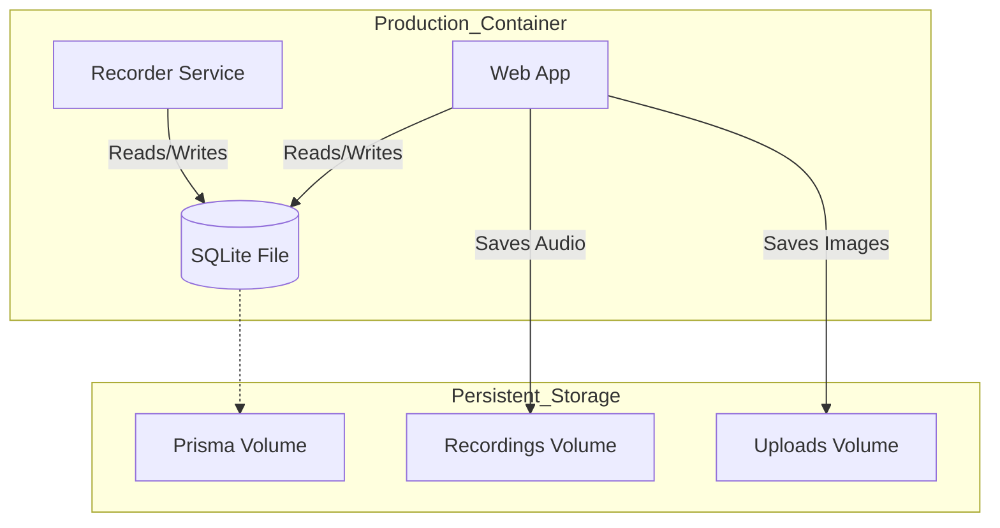

# Deployment Guide - Radio Suite (SQLite Strategy)

This guide explains how to deploy your Radio Suite to Coolify using **SQLite**.
This is the **simplest, most robust** method because it keeps your production environment identical to your local development environment.

---

## 🎯 Strategy: SQLite Everywhere

- **Local:** SQLite (`prisma/dev.db`)
- **Production:** SQLite (`prisma/dev.db` on a persistent volume)

**Benefits:**
✅ **Zero Config:** No database servers to manage.
✅ **Identical Code:** No changing `schema.prisma` before deploys.
✅ **Performance:** SQLite is incredibly fast for this use case.
✅ **Backups:** The database is just a file. Easy to backup.

---

## Phase 1: Prepare Your Code

### 1. Check `schema.prisma`
Ensure it looks exactly like this (it should already):

```prisma
datasource db {
  provider = "sqlite"
  url      = env("DATABASE_URL")
}
```

### 2. Create `ecosystem.config.js`
This runs both the website and the recorder in one container.
**File:** `ecosystem.config.js` (in project root)

```javascript
module.exports = {
  apps: [
    {
      name: 'web',
      script: 'npm',
      args: 'start',
      env: { NODE_ENV: 'production' }
    },
    {
      name: 'recorder',
      script: 'npx',
      args: 'tsx recorder-service.ts',
      env: { NODE_ENV: 'production' }
    },
  ],
};
```

### 3. Create `nixpacks.toml`
This installs FFmpeg and PM2.
**File:** `nixpacks.toml` (in project root)

```toml
[phases.setup]
nixPkgs = ['nodejs_20', 'ffmpeg-full']

[phases.install]
cmds = ['npm install', 'npm install pm2 -g']

[phases.build]
cmds = ['npx prisma generate', 'npm run build']

[start]
cmd = 'pm2-runtime start ecosystem.config.js'
```

### 4. Push to Git
Commit these new files and push to your repository.

---

## Phase 2: Coolify Setup

### 1. Create Application
1. **New Resource** → **Application**
2. Select your Git Repository & Branch
3. **Build Pack:** Nixpacks
4. **Port:** 3000

### 2. Configure Environment Variables
Go to **Environment Variables** and add:

```env
# Point to the database file in the persistent volume
DATABASE_URL="file:/app/prisma/dev.db"

# Your public URL
NEXT_PUBLIC_BASE_URL="https://your-radio.com"

# Production mode
NODE_ENV=production
```

### 3. Configure Persistent Storage (CRITICAL)
Go to **Storages** and add these 3 volumes. This ensures your data survives restarts.

| Name | Source Path (Container) | Destination Path (Host) |
|------|-------------------------|-------------------------|
| **Database** | `/app/prisma` | (Managed by Coolify) |
| **Recordings** | `/app/recordings` | (Managed by Coolify) |
| **Uploads** | `/app/uploads` | (Managed by Coolify) |

**Note:** In Coolify UI, you enter the "Destination Path" as the path inside the container (e.g., `/app/prisma`).

### 4. Deploy!
Click **Deploy**.

---

## Phase 3: Post-Deploy

### 1. Initialize Database
Since this is a fresh deploy, the database file won't exist yet.
Open the **Terminal** in Coolify for your app and run:

```bash
npx prisma migrate deploy
```

This creates the `dev.db` file with all your tables.

### 2. Verify
- Visit your URL.
- Create a show.
- Check that the show still exists after you redeploy.

---

## 🏗️ Architecture


