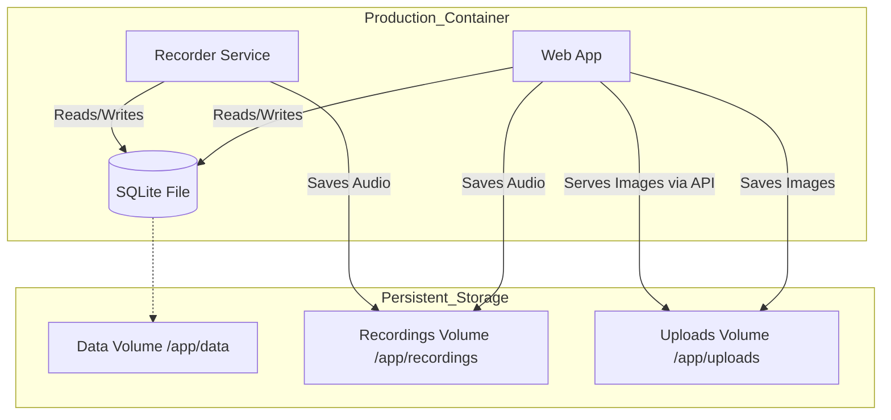

# Deployment Guide - Radio Suite (SQLite Strategy)

This guide explains how to deploy your Radio Suite to Coolify using **SQLite**.
This is the **simplest, most robust** method because it keeps your production environment identical to your local development environment.

---

## 🎯 Strategy: SQLite Everywhere

- **Local:** SQLite (`prisma/dev.db`)
- **Production:** SQLite (`/app/data/dev.db` on a persistent volume)

**Benefits:**
✅ **Zero Config:** No database servers to manage.
✅ **Identical Code:** No changing `schema.prisma` before deploys.
✅ **Performance:** SQLite is incredibly fast for this use case.
✅ **Backups:** The database is just a file. Easy to backup.

---

## Phase 1: Prepare Your Code

### 1. Check `schema.prisma`
Ensure it looks exactly like this (it should already):

```prisma
datasource db {
  provider = "sqlite"
  url      = env("DATABASE_URL")
}
```

### 2. Create `ecosystem.config.js`
This runs both the website and the recorder in one container.
**File:** `ecosystem.config.js` (in project root)

```javascript
module.exports = {
  apps: [
    {
      name: 'web',
      script: 'npm',
      args: 'start',
      env: { NODE_ENV: 'production' }
    },
    {
      name: 'recorder',
      script: 'npx',
      args: 'tsx recorder-service.ts',
      env: { NODE_ENV: 'production' }
    },
  ],
};
```

### 3. Create `nixpacks.toml`
This installs FFmpeg and PM2.
**File:** `nixpacks.toml` (in project root)

```toml
[phases.setup]
nixPkgs = ['nodejs_20', 'ffmpeg-full']

[phases.install]
cmds = ['npm ci', 'npm install pm2 -g']

[phases.build]
cmds = ['npx prisma generate', 'npm run build']

[start]
cmd = 'npx pm2-runtime start ecosystem.config.js'
```

### 4. Push to Git
Commit these new files and push to your repository.

---

## Phase 2: Coolify Setup

### 1. Create Application
1. **New Resource** → **Application**
2. Select your Git Repository & Branch
3. **Build Pack:** Nixpacks
4. **Port:** 3000

### 2. Configure Environment Variables
Go to **Environment Variables** and add:

```env
# Point to the database file in the persistent volume
# CRITICAL: Must be /app/data, NOT /app/prisma (to avoid hiding schema files)
DATABASE_URL="file:/app/data/dev.db"

# Your public URL
NEXT_PUBLIC_BASE_URL="https://your-radio.com"

# Production mode
NODE_ENV=production
```

### 3. Configure Persistent Storage (CRITICAL)
Go to **Storages** and add these 3 volumes. This ensures your data survives restarts.

| Name | Destination Path (Container) | Why? |
|------|------------------------------|------|
| **Database** | `/app/data` | Stores `dev.db`. Separated from code to prevent volume conflicts. |
| **Recordings** | `/app/recordings` | Where the recorder service saves audio files. |
| **Uploads** | `/app/uploads` | Where user images are saved. Served via Dynamic API. |

**⚠️ Important:** Do NOT use `/app/public/uploads` for the volume. We serve files dynamically from `/app/uploads`.

### 4. Deploy!
Click **Deploy**.

---

## Phase 3: Post-Deploy

### 1. Initialize Database
Since this is a fresh deploy, the database file won't exist yet.
Open the **Terminal** in Coolify for your app and run:

```bash
npx prisma migrate deploy
```

This creates the `dev.db` file in `/app/data` with all your tables.

### 2. Verify
- Visit your URL.
- Create a show.
- Upload an image (verifies `/app/uploads` volume).
- Check that the show still exists after you redeploy.

---

## 🏗️ Architecture


```mermaid
graph TD
    subgraph Production_Container
        A[Web App]
        B[Recorder Service]
        C[(SQLite File)]
    end
    
    A -- Reads/Writes --> C
    B -- Reads/Writes --> C
    
    subgraph Persistent_Storage
        D[Data Volume /app/data]
        E[Recordings Volume /app/recordings]
        F[Uploads Volume /app/uploads]
    end
    
    C -.-> D
    A -- Saves Audio --> E
    B -- Saves Audio --> E
    A -- Saves Images --> F
    A -- Serves Images via API --> F
```

## 🔧 Troubleshooting

### "Prisma schema not found"
- **Cause:** You likely mounted a volume at `/app/prisma`.
- **Fix:** Move the volume to `/app/data` and update `DATABASE_URL` to `file:/app/data/dev.db`.

### "Images 404 Not Found"
- **Cause:** Next.js Static Optimization doesn't see runtime files in `public/`.
- **Fix:** Ensure you are using the Dynamic Serving route (`/app/uploads/[filename]/route.ts`) and the volume is at `/app/uploads`.

### "Column ... does not exist"
- **Cause:** Schema changes were deployed but the production database wasn't migrated.
- **Fix:** Run `npx prisma db push` in the Coolify terminal, then restart the app with `pm2 restart all`.
